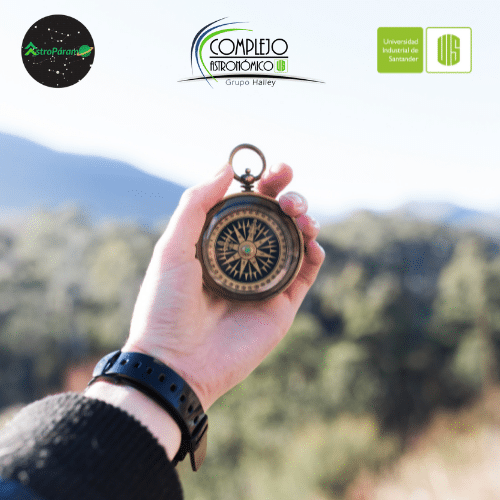
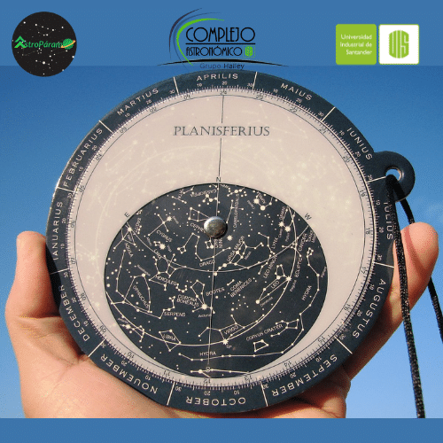
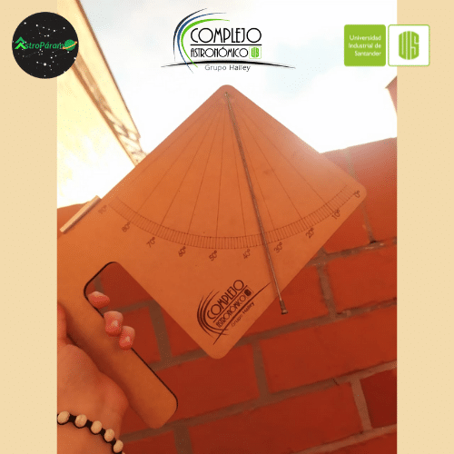

# Kit #1

## Materiales

Los elementos con los que cuenta este kit son:

### Brújula

Permite ubicarse en un sistema de referencia fijo, lo cual esencial al momento de hacer observación astronómica.&#x20;

### Carta celeste

Permite ubicar las estrellas en el firmamento con facilidad, para usarla adecuadamente:

Una alternativa si se cuenta con un smartphone es usar alguna de las siguientes aplicaciones: [Sky Map](https://play.google.com/store/apps/details?id=com.google.android.stardroid\&hl=es\_CO\&gl=US) o [Stellarium](https://play.google.com/store/apps/details?id=com.noctuasoftware.stellarium\_free\&hl=es\_CO\&gl=US), las cuales muestran una simulación muy precisa del cielo, en donde se pueden identificar diferentes cuerpos celestes. &#x20;

### Regla para medir ángulos

Este es un dispositivo que parece simple pero es efectivo, te permitirá encontrar objetos en el cielo y medir sus posiciones.

**Construcción**

ara construir esta regla, primero debemos pensar: “¿Cuál es la distancia (radio R) que necesito con el fin de obtener un artilugio que 1 grado sea equivalente a 1 cm?”. ¡Para responder esta pregunta, podemos usar las matemáticas! ¡Si usamos la relación entre la circunferencia y los grados, podemos encontrar una relación!

¡Así, podemos decir que 2piR cm que es el perímetro de un círculo es a 1cm, lo que 360 grados es a 1 grado! ¡Una regla de tres!

¡Si despejamos nos da un radio de 57 cm!

Para construir el instrumento cogemos una regla, donde fijamos una cuerda de 57 cm de longitud. Es muy importante que la cuerda no se estire. Cómo se usa: Miramos con el final de la cuerda casi tocando nuestro ojo “en la mejilla, debajo del ojo”

### Cuadrante

Este antiguo instrumento esta conformado por una placa en forma de cuarto de circunferencia (razón por la cual recibe el nombre de cuadrante), una plomada y mirilla. La placa tiene grabados los ángulos de 0 – 90°, del vértice de la placa cuelga la plomada y encima de donde está anclada la plomada se ubica la mirilla, además se puede agregar algún mecanismo para facilitar su agarre.&#x20;

El cuadrante ha sido principalmente en la astronomía y la navegación; el cuadrante astronómico permite medir la altura de los astros, tal vez su aparición mas notoria fue en siglo XVI por el astrónomo Danes Tycho Brahe, quien construyo algos con incluso dos metros de radio los cuales permitieron obtener mediciones más precisas, mismas que luego ayudaron a Keples a determinar la forma elíptica que tienen las órbitas de los planetas; mientras que la importancia del cuadrante náutico radica en que permite determinar la latitud.

