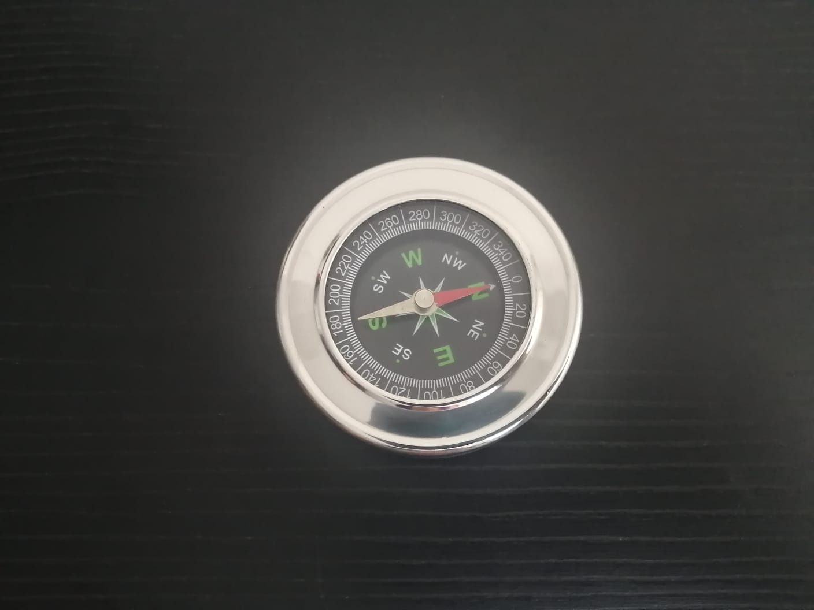
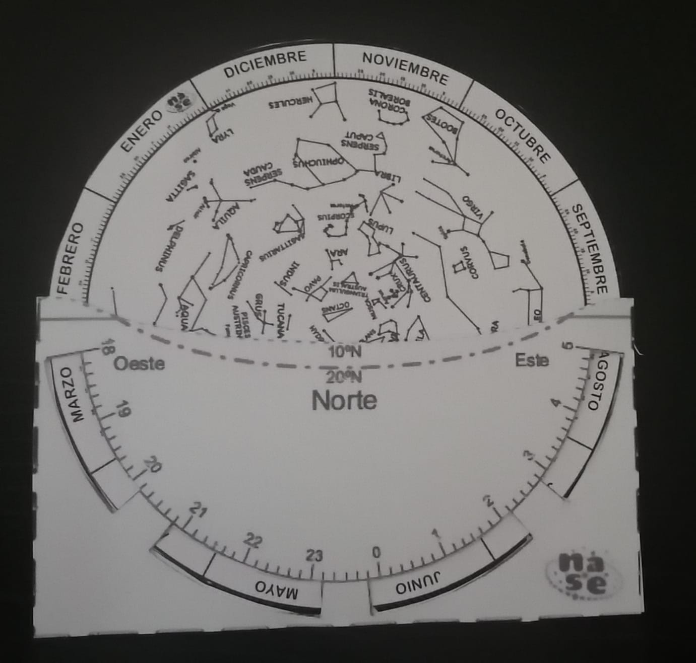
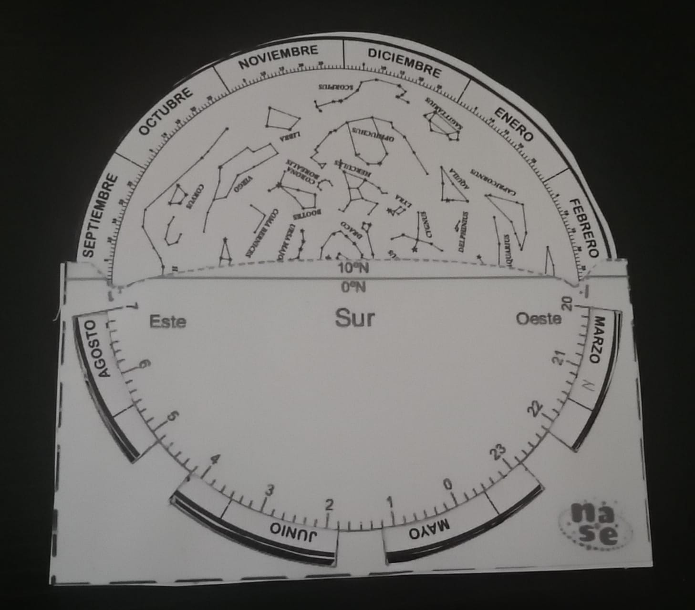
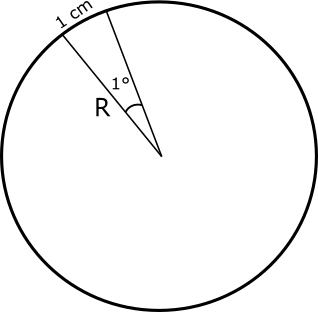
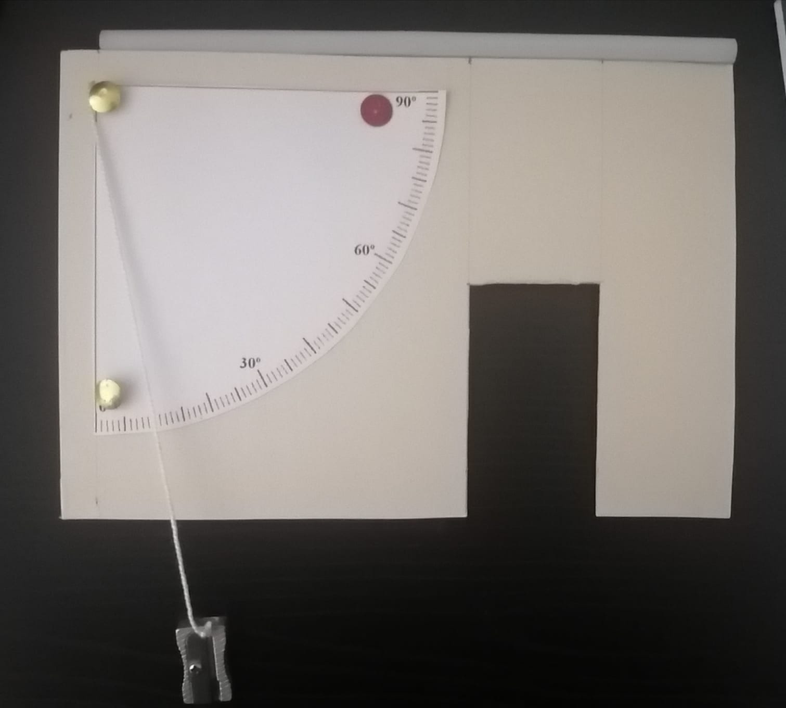

# Kit #1

## Materiales

Los elementos con los que cuenta este kit son:

### Brújula

Permite ubicarse en un sistema de referencia fijo, lo cual esencial al momento de hacer observación astronómica.&#x20;

### Carta celeste

 

Permite ubicar las estrellas en el firmamento con facilidad, para usarla adecuadamente revisa este video haciendo clic [aquí](https://www.youtube.com/watch?v=ONYaYA\_R\_48).

Una alternativa si se cuenta con un smartphone es usar alguna de las siguientes aplicaciones: [Sky Map](https://play.google.com/store/apps/details?id=com.google.android.stardroid\&hl=es\_CO\&gl=US) o [Stellarium](https://play.google.com/store/apps/details?id=com.noctuasoftware.stellarium\_free\&hl=es\_CO\&gl=US), las cuales muestran una simulación muy precisa del cielo, en donde se pueden identificar diferentes cuerpos celestes. &#x20;

### Regla para medir ángulos

Este es un dispositivo que parece simple pero es efectivo, te permitirá encontrar objetos en el cielo y medir sus posiciones.

**Construcción**

Para construir esta regla, primero debemos pensar: “¿Cuál es la distancia (radio$$R$$ ) que necesito con el fin de obtener un artilugio de forma que 1 grado sea equivalente a 1 cm?”. ¡Para responder esta pregunta, podemos usar las matemáticas! ¡Si usamos la relación entre la circunferencia y los grados, podemos encontrar una relación!

¡Así, podemos decir que $$2\pi R$$ cm que es el perímetro de un círculo es a 1 cm, lo que 360 grados es a 1 grado! ¡Una regla de tres!

¡Si despejamos nos da un radio de 57 cm!

Ahora vamos a ensamblar nuestra regla para medir ángulos, para ello vamos a fijar la cuerda de 57 cm, en el centro de nuestra cuerda como se muestra en la figura.&#x20;

Puedes ver el paso a paso de su construcción [aquí](https://youtu.be/IqnOZ\_pfl\_A).

#### Cómo se usa

Miramos con el final de la cuerda casi tocando nuestro ojo “en la mejilla, debajo del ojo”

### Cuadrante

Este antiguo instrumento esta conformado por una placa en forma de cuarto de circunferencia (razón por la cual recibe el nombre de cuadrante), una plomada y mirilla. La placa tiene grabados los ángulos de 0 – 90°, del vértice de la placa cuelga la plomada y encima de donde está anclada la plomada se ubica la mirilla, además se puede agregar algún mecanismo para facilitar su agarre.&#x20;

El cuadrante ha sido principalmente en la astronomía y la navegación; el cuadrante astronómico permite medir la altura de los astros, tal vez su aparición mas notoria fue en siglo XVI por el astrónomo Danes Tycho Brahe, quien construyo algos con incluso dos metros de radio los cuales permitieron obtener mediciones más precisas, mismas que luego ayudaron a Keples a determinar la forma elíptica que tienen las órbitas de los planetas; mientras que la importancia del cuadrante náutico radica en que permite determinar la latitud.

Para este proyecto vamos a usar un cuadrante simplificado, el **cuadrante pistola.**

#### **Construcción**

**Paso 1:** Usando una pieza rectangular de cartón duro de dimensiones (20 x 12 cm). Recorta un área rectangular como la de la _figura 1,_ esto con el fin de colocar una mano ahí.&#x20;

**Paso 2:** Toma uno de los pitillos y pégalo como se indica en la _figura 2._

**Paso 3:** Toma el cuadrante de papel (descarga), y pégalo como se indica en la _figura 3._ De forma que una de las argollas esté sobre la posición 0°.

**Paso 4:** Ata una cuerda en la parte de arriba (donde esta el asterisco en la _figura 4_), en la parte libre de la cuerda fija un pequeño peso.

Finalmente el resultado será muy similar a esté.&#x20;

Puedes ver el paso a paso de su construcción [aquí](https://youtu.be/Vxtwl\_XeFog).

#### Cómo se usa

Cuando se ve el objeto a través de la mira (pitillo), la cuerda indica la posición angular referida a los 0° del horizonte. _Figura 5_

####

