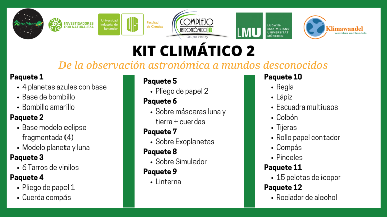

# Kit #2

Este kit contiene los materiales distribuidos en 12 paquetes de la siguiente forma:

#### **Actividad #1**

* Cuatro planetas azules con base
* Bombillo amarillo&#x20;
* Base de bombillo

#### Paquete 2

* Base modelo eclipse fragmentada (4)
* Modelo planeta y luna

#### Paquete 3

* Seis tarros de vinilos

#### Paquete 4

* Un pliego de papel
* Cuerda compás

#### Paquete 5

* Dos pliegos de papel

#### Paquete 6

* Sobre máscaras luna y tierra + cuerdas

#### Paquete 7

* Sobre exoplanetas

#### Paquete 8

* Sobre simulador

#### Paquete 9

* Linterna

#### Paquete 10

* Regla
* Lápiz
* Escuadra multiusos
* Colbón
* Tijeras
* Rollo papel contador
* Compás
* Pinceles&#x20;

#### Paquete 11

* 15 pelotas de icopor

#### Paquete 12

* Rociador de alcohol

