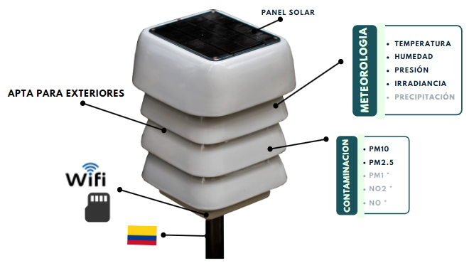

# EVA: estación meteorológica

EVA es una estación de variables ambientales modular diseñada para apoyar proceso de medición climática y de calidad de aire con una alta confiabilidad. Esta estación fue diseñada por [MakeSens](https://makesens.co).


Presentación EVA


#### Estructura de EVA

#### Principales características&#x20;

|          Medición          | Propiedades                                                                                                                                                           |
| :------------------------: | --------------------------------------------------------------------------------------------------------------------------------------------------------------------- |
|      Temperatura \[°C]     | 
Rango: 0-85 °C Resolución: 0.01 °C Precisión: 1°C
                                                                                                        |
|   Humedad relativa \[%RH]  | 
Rango: 0-100 %RH Precisión: \pm3% RH
                                                                                              |
| Presión atmosférica \[Hpa] | 
Rango: 300-1000 HPa Precisión: 1 HPa
                                                                                                                        |
|    PM10 \[$$\mu g/m^3$$]   | 
Rango: 0-1000 \mu g/m^3 Resolución: 1 \mu g/m^3 Precisión: \pm 5 \mu g/m^3
 |
|    PM10 \[$$\mu g/m^3$$]   | 
Rango: 0-1000 \mu g/m^3 Resolución: 1 \mu g/m^3 Precisión: \pm 5 \mu g/m^3
 |
